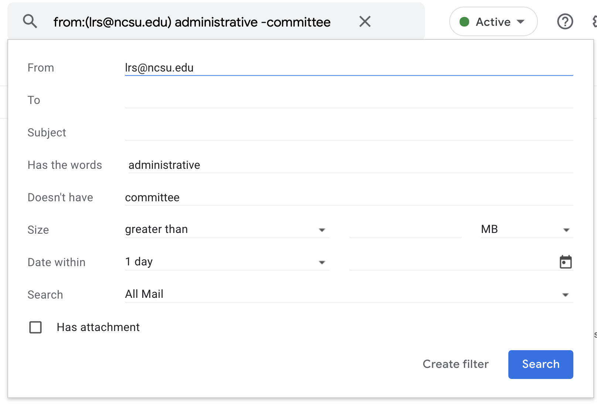
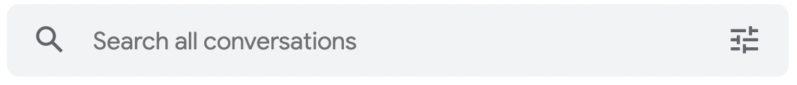

# Creating a Filter in Gmail

1.  Open Gmail.
2.  In the search box at the top, click the Search Options icon.
3.  Enter your search criteria (figure 2). If you want to check that your search worked correctly, see what emails show up by clicking Search.
     
4.  At the bottom of the search window, click Create filter.
5.  Choose what you’d like the filter to do (figure 3).
     

    Common filter options include:

    - **Skip the Inbox**: message is archived
    - **Star it** message is marked as important
    - **Apply the label ------- **: message is given a label of your choosing
    - **Forward it**: message is sent to another address (e.g., home email)
    - **Never send to spam**: message arrives in inbox, avoiding spam filter
    - **Delete it**: message is deleted before arriving in the inbox

6.  Click Create filter.

**Note**: When you create a filter to forward messages, only new messages will be affected. Additionally, when someone replies to a message you've filtered, the reply will only be filtered if it meets the same search criteria.
